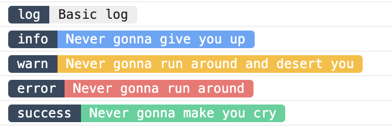

# FancyLog.js
FancyLog is a silly, but fun logging utility for browser `console.log()`. Simply put, it makes badges in the console. 



## Demo
https://unpkg.com/@ikoncept/fancylog@1.0.2/dist/demo/index.html

## Installation
```sh
$ yarn add @ikoncept/fancylog
```

## Usage
```js
import FancyLog from '@ikoncept/fancylog'

const fancylog = new FancyLog()
fancylog.log('log', 'Basic log')
fancylog.info('info', 'Never gonna give you up')
fancylog.warn('warn', 'Never gonna run around and desert you')
fancylog.error('error', 'Never gonna run around')
fancylog.success('success', 'Never gonna make you cry')
```

## Customization
You can provide an object for any (or all) available fancylog types (`default`, `error`, `info`, `warn`, `success`). This will be merged over default values, so no need to provide all four properties if you just want to nudge background colors.

Available properties per fancylog type: 
- `badgeBackground` - Background for label
- `badgeText` - Text color for label
- `background` - Background for message
- `text` - Text color for message

```js
fancylog = new FancyLog({
    'default': { 
        'badgeBackground': '#A78BFA'
    },
    'error': {  
        'background': '#f0f0f0', 
        'text': '#F87171' 
    },
    'info': { 
        'badgeBackground': '#A78BFA', 
        'background': '#f0f0f0', 
        'text': '#60A5FA' 
    },
    'warn': { 
        'text': '#FBBF24' 
    },
    'success': { 
        'background': '#D1FAE5', 
    }
})
```